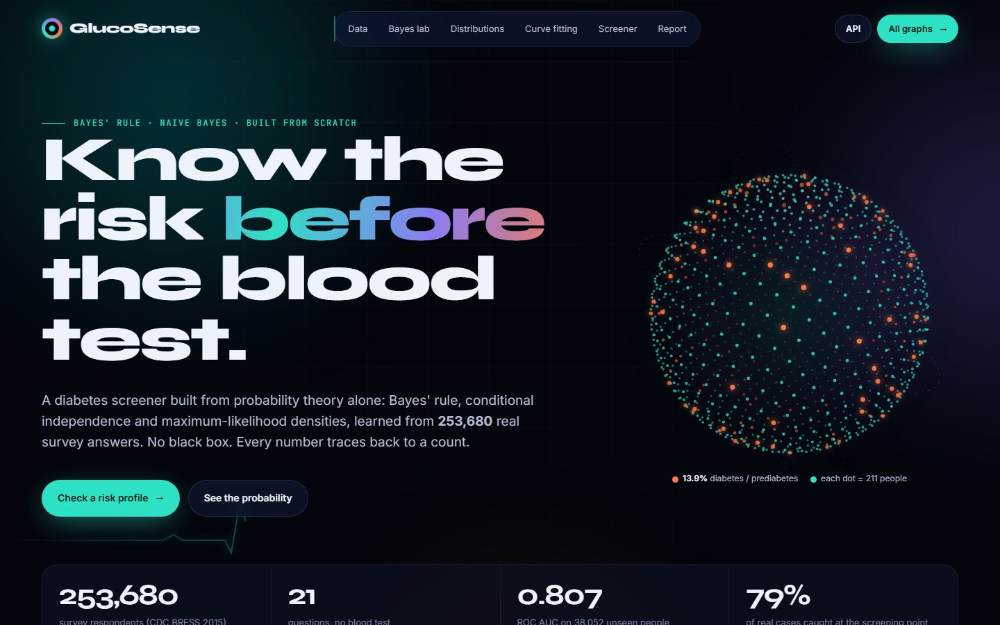
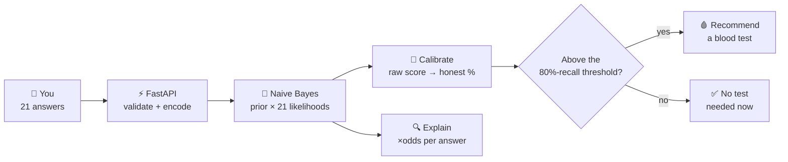
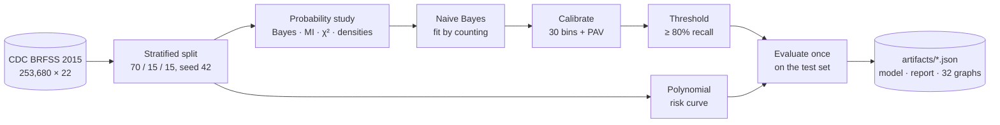
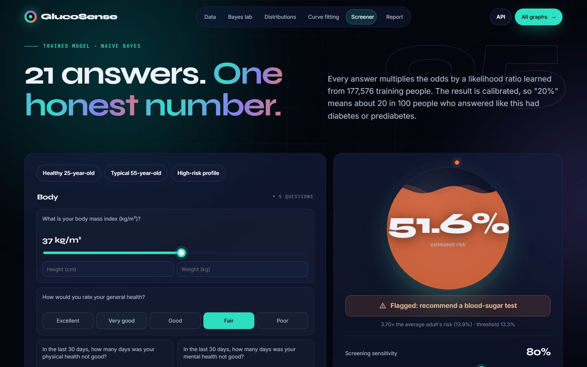
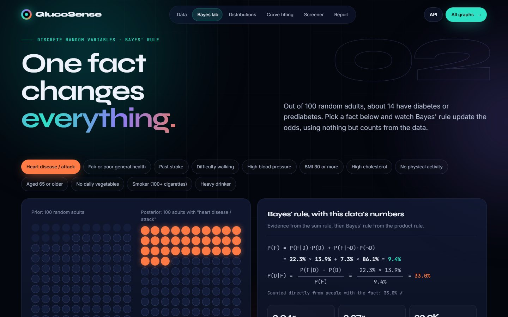
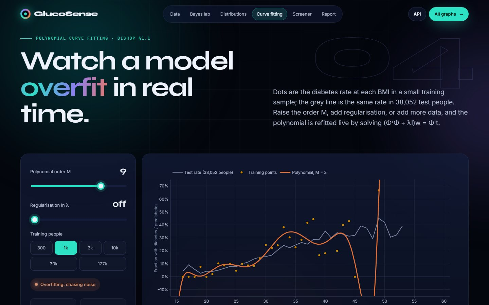
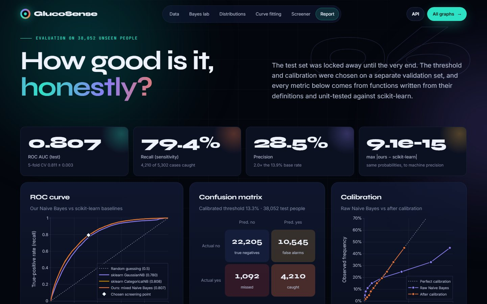
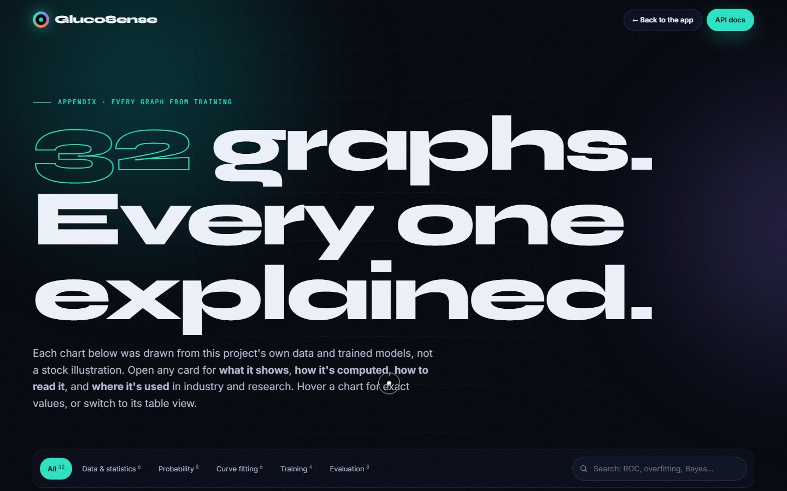
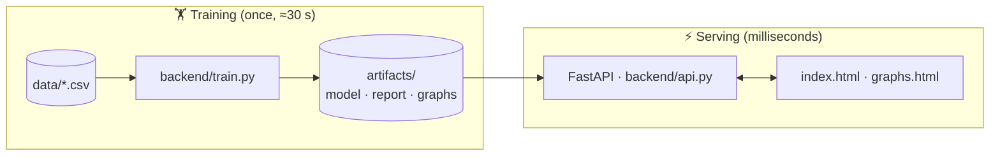

<div align="center">

# 🩺 GlucoSense

### Know your diabetes risk *before* the blood test.

**21 simple questions → a calibrated risk %, a clear test / no-test recommendation, and the reasons behind it.**<br>
A Naive Bayes screener written from scratch in NumPy and trained on **253,680** real health-survey responses.




[The problem](#problem) · [What it does](#what) · [How it works](#how) · [Models](#models) · [Results](#results) · [Screenshots](#screenshots) · [Run it](#run)

</div>

---

## 📌 At a glance

| 👥 Trained on | ❓ Questions | 🎯 ROC AUC | 🚨 Real cases caught | 🧪 Tests | 📦 ML libraries in the model |
|:---:|:---:|:---:|:---:|:---:|:---:|
| **253,680** people | **21** | **0.807** | **79.4%** | **17** passing | **0** (pure NumPy) |

---

<a id="problem"></a>
## 🩸 The problem

> **India had about 101 million adults with diabetes and another 136 million with prediabetes in 2021**
> (ICMR-INDIAB study, *The Lancet Diabetes & Endocrinology*, 2023).

- **Prediabetes is silent.** It can often be reversed if caught early, but it has no symptoms, so many people find out years too late.
- **Blood tests don't scale.** HbA1c or fasting glucose confirms it, but testing everyone costs time, money and test kits.
- **So health workers triage with questions first.** Short risk questionnaires decide who gets tested. GlucoSense is that questionnaire, powered by probability and machine learning, with an honest number and an explanation instead of a bare score.

---

<a id="what"></a>
## 💡 What it does

```
  ①  ANSWER            ②  WEIGH THE EVIDENCE     ③  CALIBRATE             ④  DECIDE
 ┌──────────────┐     ┌───────────────────┐     ┌──────────────────┐     ┌──────────────────┐
 │ 21 questions │     │ Naive Bayes: each │     │ raw score → an   │     │ flag for a blood │
 │ health, body │ ──▶ │ answer multiplies │ ──▶ │ honest % ("20%"  │ ──▶ │ test if the risk │
 │ lifestyle    │     │ the odds up/down  │     │ = 20 in 100)     │     │ is high enough   │
 └──────────────┘     └───────────────────┘     └──────────────────┘     └──────────────────┘
     ~2 minutes            milliseconds             learned on            tuned to catch
     no needle                                      held-out data         ≥ 80% of cases
```

| Output | What you see |
|---|---|
| 🎯 **Calibrated risk %** | A liquid gauge that updates live as you answer. |
| 🩸 **Test recommendation** | Get a blood test or not, at a sensitivity you choose (catch 50% to 95% of cases). |
| 🔍 **The evidence** | Every answer shown as an odds multiplier: ×2 doubles your odds, ×0.5 halves them. |
| 📈 **Population curve** | Where your BMI sits on the diabetes-rate-vs-BMI curve. |

Around the screener the app has a **Bayes lab**, a **distributions lab**, a **live curve-fitting lab**, a **test-set report**,
and a **graphs page that explains all 32 training charts**.

---

## 👥 Who it's for

<sub>*Illustrative personas, not real people.*</sub>

| 🩺 The community health worker | 🧑‍💼 The 45-year-old with a desk job | 🏥 The clinic |
|---|---|---|
| Runs a screening camp: 200 people turn up, 20 test kits. GlucoSense ranks who should get tested first, in two minutes per person, with no needle. | Feels fine, has no symptoms and isn't sure a test is worth it. Sees that blood pressure, BMI and inactivity are what push the risk up, and what to change. | Uses it as a two-minute pre-consultation form that flags high-risk patients for an HbA1c test before the doctor sees them. |

---

<a id="how"></a>
## 🔄 How a prediction works



The whole round trip takes milliseconds, so the gauge updates live as you answer.

### Training pipeline



The full pipeline runs in **about 30 seconds** on a laptop CPU.

---

<a id="models"></a>
## 🧠 The models

<details open>
<summary><b>1. Naive Bayes classifier</b>: the screener</summary>

<br>

Bayes' rule turns a prior into a posterior, and the *naive* assumption (answers are independent once you know the class)
lets the 21 likelihoods simply multiply:

```math
P(D \mid \mathbf{x}) = \frac{P(D)\prod_{j=1}^{21} p(x_j \mid D)}{\sum_{d \in \{0,1\}} P(d)\prod_{j=1}^{21} p(x_j \mid d)}
```

| Answer type | Likelihood | How it's learned |
|---|---|---|
| Yes / no (14 answers) | Bernoulli | Counts with Laplace smoothing, α = 1 |
| Scales and bands (general health, age, education, income) | Categorical | Counts with Laplace smoothing |
| Poor-health days (0–30) | 6 bins → categorical | The counts are zero-inflated, so binning beats a Gaussian |
| BMI | **Log-normal** | Maximum likelihood per class; it beats a Gaussian on validation (AUC 0.811 vs 0.809) |

Everything runs in **log space** with log-sum-exp. Because the log-odds is a *sum* of one term per answer, every answer's
contribution can be shown to the user.

</details>

<details>
<summary><b>2. Probability calibration</b>: making "20%" mean 20%</summary>

<br>

Correlated answers (general health and poor-health days, for example) get counted as independent evidence, so raw
scores drift to 0 and 1. In the top bin the raw model said **96%**, but only **45%** of those people had diabetes.
The fix: sort validation people into 30 equal-count bins, estimate the real rate in each with Laplace's rule of
succession, (k + 1)/(n + 2), and force it to be non-decreasing with **pool-adjacent-violators**.

**Log-loss 0.512 → 0.327, Brier 0.143 → 0.101**, and the ranking (AUC) is untouched.

</details>

<details>
<summary><b>3. Decision threshold</b>: who gets a blood test</summary>

<br>

Accuracy is misleading here: answering "no" to everyone is 86% accurate. A missed case costs far more than an extra
test, so the threshold is the highest score that still catches **≥ 80% of real cases** on the validation set, which is
a calibrated risk of **13.3%**. The app's sensitivity slider switches between pre-computed operating points.

</details>

<details>
<summary><b>4. Polynomial curve fitting</b>: the population risk curve</summary>

<br>

The diabetes rate at each whole-number BMI (15–60), fitted by regularised least squares:

```math
(\Phi^\top\Phi + \lambda I)\,\mathbf{w} = \Phi^\top \mathbf{t}
```

On a small 1,000-person sample the test error is lowest at **M = 2** (E_RMS 0.049) and explodes at **M = 9** (8.13) and
**M = 12** (186.9): overfitting you can watch live in the app. The shipped curve (M = 9, ln λ = −30, fitted on all
177,576 training people) reaches a test E_RMS of **0.0309**.

</details>

<details>
<summary><b>5. The probability toolkit</b>: reading the data</summary>

<br>

- **Bayes' rule, worked:** heart disease raises P(diabetes) from 13.9% to **33.0%** (likelihood ratio 3.04), which exactly matches a direct count.
- **Independence tests:** mutual information and χ² with Cramér's V. General health and high blood pressure carry the most information.
- **Conditional independence:** conditional mutual information shows which answer pairs break the naive assumption.
- **Densities and moments:** Gaussian vs log-normal maximum-likelihood fits, Q-Q plots, quantiles, the law of total expectation, covariance.

</details>

---

<a id="results"></a>
## 📊 Results

Measured **once**, on **38,052 people** the model never saw during training or tuning.

| Metric | Value |
|---|---|
| ROC AUC | **0.807** (5-fold cross-validation 0.811 ± 0.003) |
| Recall (real cases caught) | **79.4%** (4,210 of 5,302) |
| Precision | **28.5%**, 2× the 13.9% base rate |
| Specificity | 67.8% |
| People referred for a blood test | 38.8% |
| Average precision | 0.381 |
| Log-loss, raw → calibrated | 0.512 → **0.327** |

<details>
<summary><b>Choose your sensitivity</b>: the screening trade-off</summary>

<br>

| Target recall | Test recall | Precision | Specificity | People flagged |
|:---:|:---:|:---:|:---:|:---:|
| 50% | 50.3% | 37.8% | 86.6% | 18.5% |
| 60% | 60.0% | 34.7% | 81.8% | 24.1% |
| 70% | 68.2% | 31.7% | 76.2% | 30.0% |
| **80%** (default) | **79.4%** | **28.5%** | **67.8%** | **38.8%** |
| 90% | 89.6% | 24.0% | 54.1% | 52.0% |
| 95% | 94.9% | 21.1% | 42.7% | 62.5% |

</details>

**Verified, not just claimed:**

| Check | Result |
|---|---|
| Our Naive Bayes vs scikit-learn `CategoricalNB` (same data, same α) | probabilities agree to **9.1 × 10⁻¹⁵** |
| scikit-learn `GaussianNB` on the raw columns | AUC 0.780, log-loss 1.23: choosing a density per answer type matters |
| Quantiles, covariance, inverse normal, polynomial fit, ridge, ROC / AP | match NumPy, SciPy and scikit-learn |

---

<a id="screenshots"></a>
## 🖼️ Screenshots

| | |
|:---:|:---:|
| <br>**The screener**: 21 answers, one honest number | <br>**Bayes lab**: watch prior become posterior |
| <br>**Curve-fitting lab**: overfitting, live | <br>**Report**: test-set results, no spin |
| <br>**32 graphs, explained**: what, how, read, where | <br>**Landing**: a 3D sphere of 1,200 particles, one per 211 people |

---

## 🏗️ Architecture



| Layer | Technology |
|---|---|
| Models and statistics | Python 3.10+, **NumPy** (every estimator), pandas (loading), SciPy (χ² tail only) |
| API | FastAPI + Uvicorn, Pydantic validation, auto docs at `/docs` |
| Frontend | Plain HTML, CSS and JavaScript ES modules, no framework and no build step; Plotly.js bundled for offline use; Canvas 3D sphere; Web Animations API |
| Quality | pytest (17 tests), scikit-learn used **only** as a reference in tests |

---

<a id="run"></a>
## 🚀 Run it locally

```bash
git clone https://github.com/krishkavin7512/GlucoSense.git
cd GlucoSense

python -m venv .venv
.venv\Scripts\activate          # Windows
source .venv/bin/activate       # macOS / Linux

pip install -r requirements.txt
python run.py                   # opens http://127.0.0.1:8001
```

The trained models ship in `artifacts/`, so the app starts instantly.

| Command | What it does |
|---|---|
| `python run.py --retrain` | Retrain everything from scratch (≈30 s) |
| `python -m backend.train --charts-only` | Rebuild the 32 graphs without retraining |
| `python -m pytest` | Run the 17 tests |

<details>
<summary><b>API endpoints</b></summary>

<br>

| Endpoint | Returns |
|---|---|
| `GET /api/overview` | Headline metrics, split sizes, scikit-learn checks |
| `GET /api/features` | Question metadata, defaults, operating points |
| `GET /api/data/preview` · `GET /api/data/summary` | Raw rows · per-column statistics |
| `GET /api/stats/probability` · `GET /api/stats/bmi` | Bayes tables and independence tests · BMI quantiles, densities, moments |
| `GET /api/polyfit` | A live polynomial fit for order M, λ and sample size |
| `POST /api/predict` | Risk %, flag, operating point, per-answer contributions |
| `GET /api/graphs` · `GET /api/graphs/{id}` | Training figures with explanations |

Interactive docs: http://127.0.0.1:8001/docs

</details>

<details>
<summary><b>Project structure</b></summary>

<br>

```
GlucoSense/
├── run.py                  one command: train if needed, then serve
├── backend/
│   ├── config.py           seed, split, the 21-question feature dictionary
│   ├── data.py             load · split · bin · summarise
│   ├── probability.py      Bayes, MI, χ², CMI, densities, quantiles, covariance
│   ├── naive_bayes.py      the classifier
│   ├── calibration.py      binning + Laplace + pool-adjacent-violators
│   ├── polyfit.py          polynomial least squares + ridge
│   ├── metrics.py          ROC, PR, log-loss, Brier, calibration
│   ├── train.py            the pipeline
│   ├── charts.py           32 figures + explanations
│   └── api.py              FastAPI app
├── frontend/               index.html · graphs.html · assets/
├── artifacts/              trained model, report, graphs (JSON)
├── data/                   the dataset (CSV)
└── tests/                  17 tests
```

</details>

---

## ⚠️ Limitations and roadmap

**Know the limits**
- Trained on **U.S.** survey data. South Asians develop diabetes at lower BMIs, so retrain on Indian data before real use.
- Answers are **self-reported**, and diabetes and prediabetes share one label.
- It **triages**, it does not diagnose.

**What's next**
- [ ] Retrain on Indian surveys (ICMR-INDIAB, NFHS); add waist size and family history
- [ ] Support "don't know" answers by dropping that factor from the product
- [ ] Model the strongest answer dependencies (tree-augmented Naive Bayes)
- [ ] A six-question, multilingual mobile version for health workers

---

## 📄 License

Released under the [MIT License](LICENSE). © 2026 Kavin Krish.

## 🙏 Acknowledgments

- **CDC Behavioral Risk Factor Surveillance System (BRFSS) 2015**, via the [UCI Machine Learning Repository, dataset 891](https://archive.ics.uci.edu/dataset/891/cdc+diabetes+health+indicators) (CC BY 4.0)
- **ICMR-INDIAB** (Anjana et al., 2023) for the Indian prevalence figures, and the **Indian Diabetes Risk Score** (Mohan et al., 2005) for the idea of questionnaire triage
- C. M. Bishop, *Pattern Recognition and Machine Learning*, and K. P. Murphy, *Machine Learning: A Probabilistic Perspective*
- Zadrozny & Elkan (2001) on calibrating Naive Bayes; FastAPI, Plotly.js and NumPy

---

<div align="center">

**GlucoSense**: *because the first step to beating diabetes is knowing you should get tested.*

⚕️ An educational tool, not a medical device.

</div>
